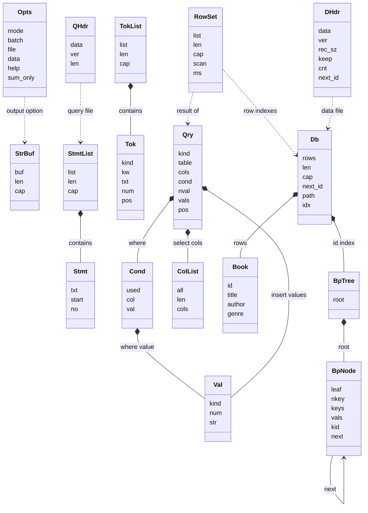

# 클래스 다이어그램

이 문서는 머메이드 렌더러에서 바로 그림으로 보이도록, 실제 구조체를
렌더 안정성이 높은 형태로 단순화한 클래스 다이어그램입니다.

## 읽는 순서 추천
1. `StmtList -> TokList -> Qry`
2. `Db -> Book -> BpTree`
3. `RowSet`
4. `QHdr / DHdr`

## 핵심 포인트
- `Qry`는 parser가 만든 내부 쿼리 표현입니다.
- `Db`는 메모리 캐시와 `id` 전용 B+ 트리를 함께 들고 있습니다.
- `RowSet`은 실제 행 복사본이 아니라, 캐시 행 인덱스와 탐색 결과 요약입니다.
- `QHdr`와 `DHdr`는 각각 query/data 바이너리 파일 헤더입니다.
